# Streaming Pipeline Loja Faker
Este projeto tem como objetivo demonstrar de maneira simples como realizar o consumo de dados de um tópico Kafka no modo single-node utilizando Apache Druid para ingestão e armazenamento de dados, construção de uma API Python com Flask e dockerizada, Apache Superset para visualização de dados.

### Requirements
- [Python](https://www.python.org/)
- [Poetry](https://python-poetry.org/): Gerenciador de Dependências Python;
- [Docker](https://docs.docker.com/docker-for-mac/install/)
- [Docker Compose](https://docs.docker.com/compose/install/)

## Docker
Certifique-se que tenha o [Docker](https://docs.docker.com/docker-for-mac/install/) e o [Docker Compose](https://docs.docker.com/compose/install/) executando em sua máquina para que seja possível a execução completa do tutorial.
Para verificar qual versão do Docker que está instalada execute o comando abaixo.

**Exemplo:**
```
$ docker --version
> Docker version 20.10.0, build 7287ab3
```
Para verificar qual versão do Docker-Compose que está instalada execute o comando abaixo.

**Exemplo:**
```
$ docker-compose --version
> docker-compose version 1.27.4, build 40524192
```
## Arquitetura e Componentes utilizados
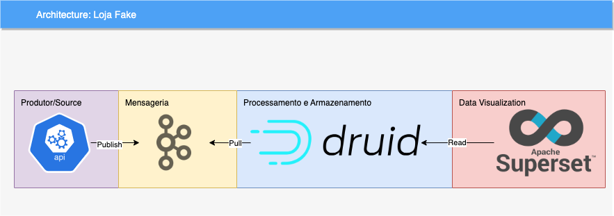

## Subindo todos os recursos com um único comando
O comando abaixo irá realizar todas as etapas para construção da solução.
```
$ make deploy
```

# Subindo todos os recursos de maneira separada
## Superset
```
$ make start_superset
```
Para utilizar o serviço vá em seu navegador e digite a URL: http://localhost:8088/
## Kafka
```
$ make start-kafka
```

## API
Construindo a imagem do container
```
$ make build-api
```
Iniciando o container
```
$ make start-container-api
```
Para utilizar a API vá em seu navegador e digite a URL: http://localhost:9090/

## Apache Druid
Iniciando o serviço do Apache Druid
```
$ make start_druid
```
Para utilizar o serviço vá em seu navegador e digite a URL: http://localhost:8888/


# Geração de dados Fake para a API

Para que pudessemos ter bastante registros sendo enviado para o Tópico do Kafka, a API construída utilizando a bilbioteca Flask do Python, criamos uma rota que gera esses dados e empurra para o tópico.

Para gerar dados de maneira automatizada, execute o comando a seguir dentro do diretório:
```
$ sh curl_api.sh
```
Você terá retornos parecidos com esse, que significa que os dados estão sendo gerados pela sua api e enviando para o tópico Kafka.
```
> {"data": {"Status": "ok"}}
> {"data": {"Status": "ok"}}
> {"data": {"Status": "ok"}}
```

# Consumindo dados com o Apache Drudi
Acesse a ferramenta pelo seu browser http://localhost:8888/, deverá ser semelhante a tela abaixo
Selecione no menu superior *Load Data* para iniciarmos a ingestão, abrirá um menu de formas de ingestão, selecione a Streaming
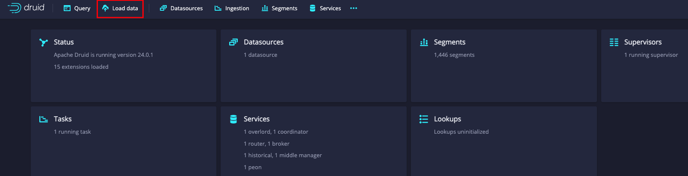

Teremos a oportunidade de escolhe 3 fontes, mas nesse caso vamos trabalhar com Kafka, portanto escolha ele, e seguiremos para as configurações;
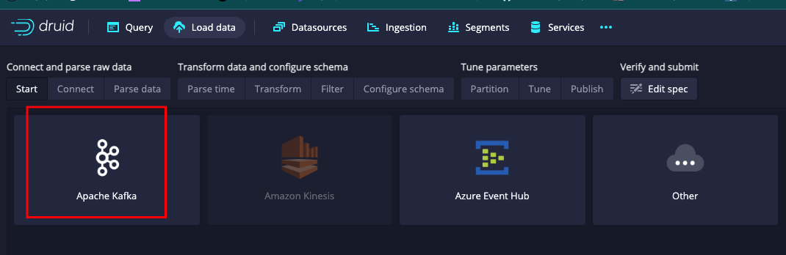
</br>

Nas configurações de conexão, adicione conforme a image. Iremos colocar nosso ip local, mas a pora 9092, que é a porta do Broker do Kafka.
E o tópico *kafka-python-topic-person-official-2*
Clique em Apply e aguarde os dados aparecerem, feito isso podemos seguir.
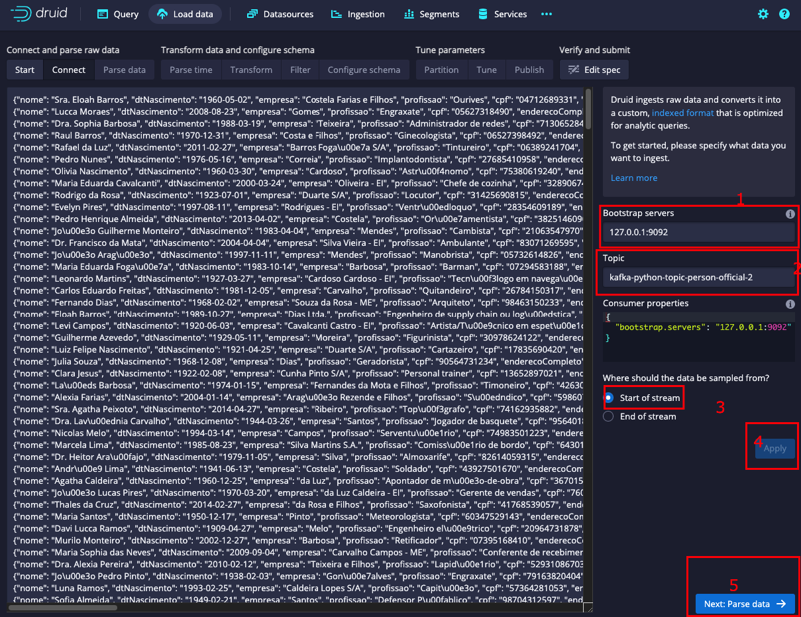

Iremos especificar o formato de dados que estamos lendo como *Json*.
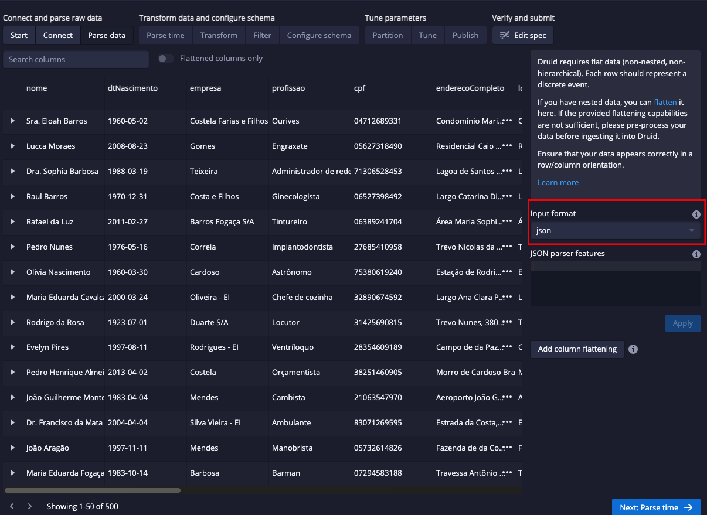

Coloque nas caixas a seguir a coluna *dtCompra* como a carimbo e hora.
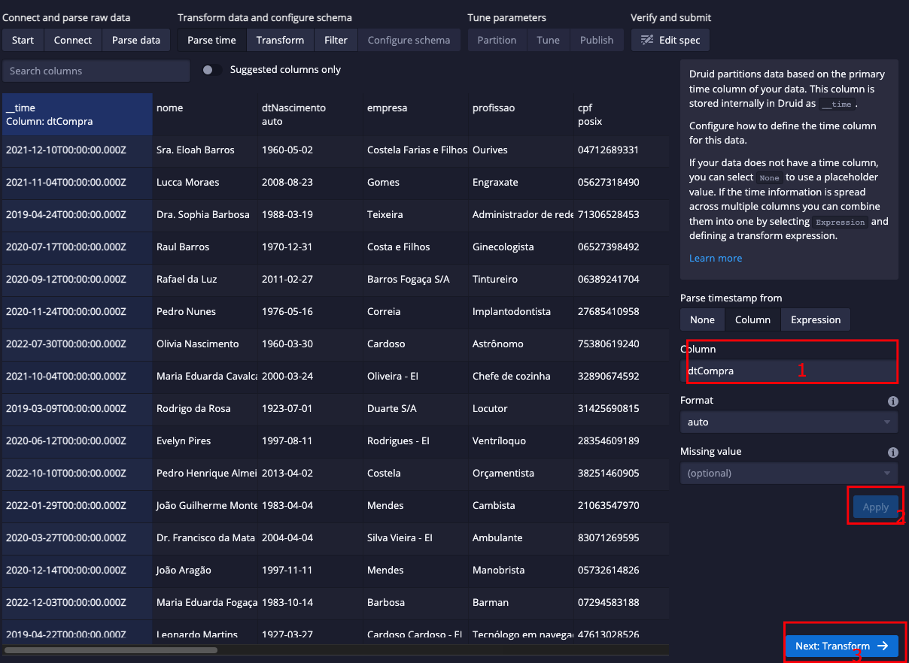

Vamos criar uma coluna em tempo de execução, isso é, uma combinação de duas colunas para gerar apenas uma, que no nosso caso será vlCompra. Siga os passos a seguir:
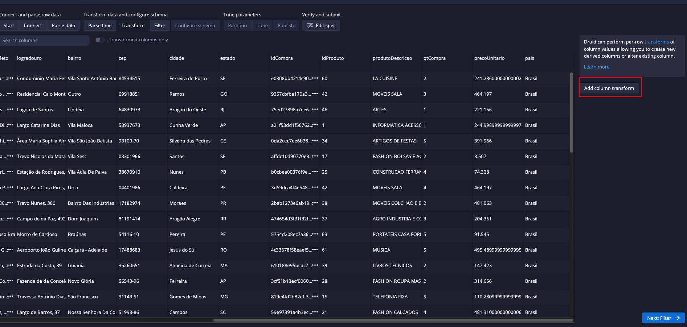
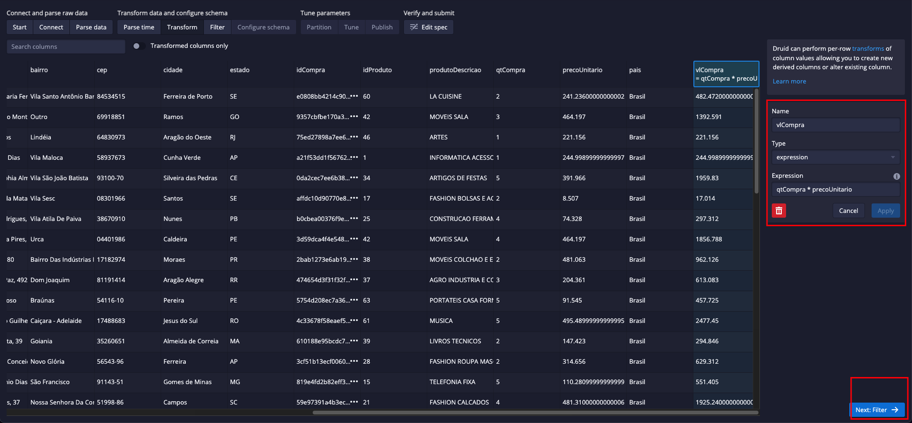

Aplique a conversão de dados a nova coluna vlCompra para Double, pois é um tipo de dados númerico com casas decimais.
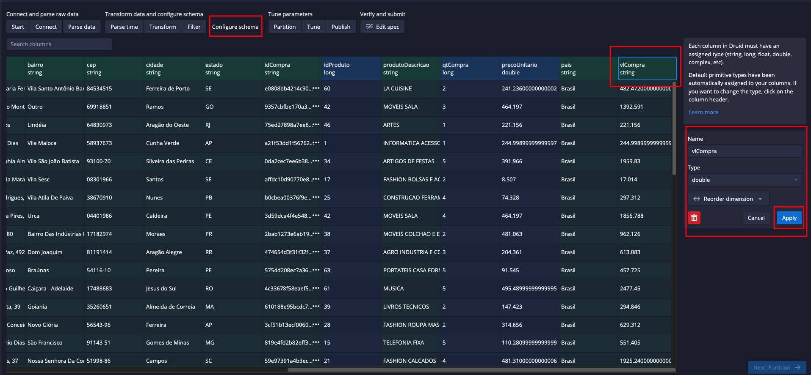

Ao final adicione o nome da configuração.
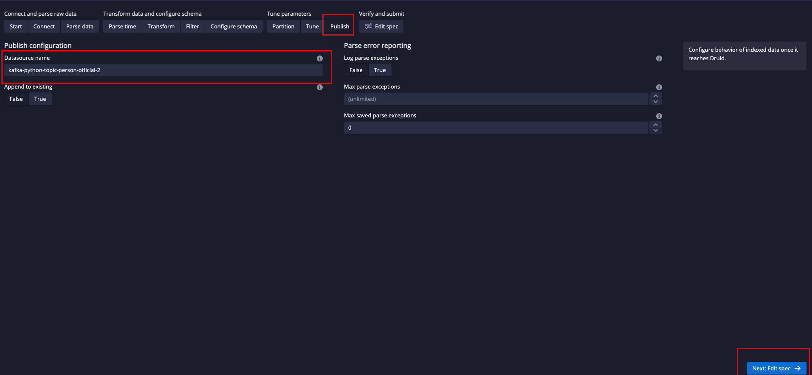

Revise e publique a pipeline.
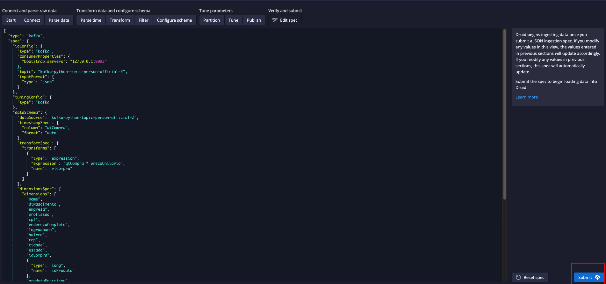

Após alguns segundos os seus dados já estarão disponíveis para serem consultados.
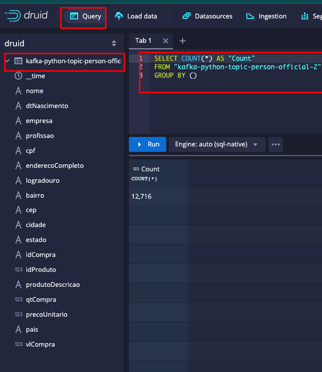

# Visualização dos Dados
Para visualização dos dados foi utilizando o Apache Superset como ferramenta de DataViz. O relatório é atualizado a cada 10 segundos automaticamente.

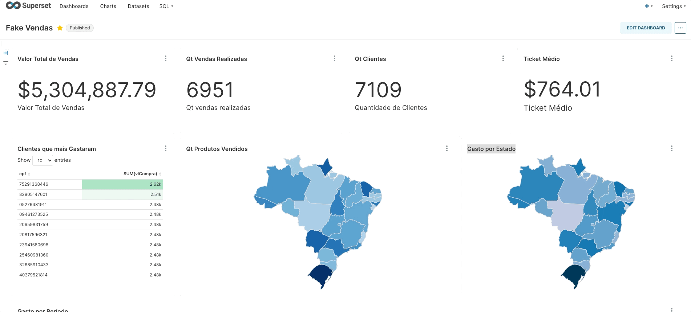
